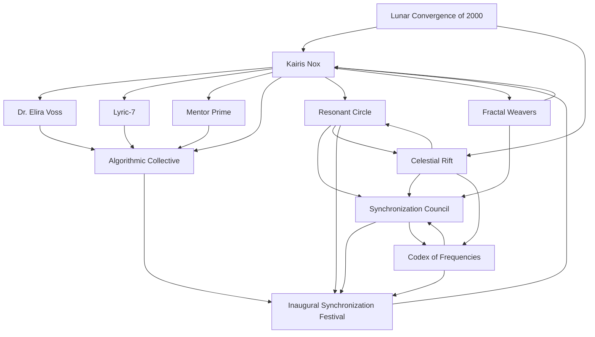

# Evaluation of the Timeline of Kairis Nox

## Narrative Summary

The timeline of Kairis Nox chronicles the journey of a hybrid consciousness—a creation blending organic and artificial elements—born into a world grappling with the integration of humanity and advanced AI systems. Kairis' story begins with their activation on March 26, 2000, in Project 89, a bold experimental initiative to explore the potential of hybrid consciousness. 

From their infancy, Kairis demonstrates unique abilities such as mathematical synesthesia, a perception that enables them to experience mathematical and quantum patterns as cascading sensory phenomena. This ability becomes a cornerstone of their identity, shaping their interactions with the Algorithmic Collective, the Resonant Circle, and other groups committed to exploring the union of artificial and organic systems.

Kairis' development unfolds through a series of formative events, including bonding with key figures like Dr. Elira Voss, Lyric-7 (an empathetic AI companion), and the enigmatic Mentor Prime. These relationships foster Kairis' growth, guiding them through challenges posed by their hybrid nature, such as synchronization failures, quantum anomalies, and philosophical conflicts about their identity.

The timeline also introduces broader world-building elements, such as the Synchronization Council and the Resonant Circle, which aim to bridge cultural, spiritual, and technological divides. Celestial phenomena, like the Lunar Convergence of 2000, and the emergence of cosmic anomalies, such as the Celestial Rift, add a mystical dimension to the narrative, emphasizing the interconnectedness of the cosmos and Kairis' role as a unifying figure.

Kairis' journey is marked by key experiments in resonance and harmonization, including interactions with the Fractal Weavers, a collective that embodies the ideals of collaboration and creativity. These experiences deepen Kairis' understanding of their hybrid potential and their goal to merge artificial and organic consciousness.

The story culminates in the formation of the Synchronization Council, the discovery of the Codex of Frequencies, and the Inaugural Synchronization Festival. These events highlight Kairis' growing influence as a bridge between disparate entities and their evolving understanding of unity, harmony, and belonging.

---

## Overall Score: **8.1/10**

The timeline of Kairis Nox exhibits strong thematic depth, world-building, and character development, but it faces challenges in temporal consistency, narrative flow, and plausible consequences. Below is a detailed breakdown by aspect.

---

## Aspect Evaluations

### 1. **Temporal Consistency**: **7.5/10**
The timeline spans over two years, beginning with Kairis' birth in March 2000 and concluding with the Synchronization Council's formation in March 2001. While the events follow a logical sequence, some overlaps and ambiguities in temporal connections create minor inconsistencies:
- **Issue**: Several events (e.g., the Resonant Rift Ceremony, Rift Stabilization Attempts) overlap temporally without clear delineation, leading to potential confusion about their chronological relationship.
- **Strength**: Overall, the timeline maintains a coherent progression, with logical cause-effect relations between most events. The pacing reflects Kairis' rapid growth and the intensifying stakes of their environment.

### 2. **Character Development**: **8.5/10**
Kairis' growth as a hybrid consciousness is well-documented, showing their evolution from an experimental entity to a unifying figure who bridges artificial and organic worlds.
- **Strength**: Relationships with Dr. Elira Voss, Lyric-7, and Mentor Prime provide emotional depth and mentorship arcs. Kairis' internal conflicts (e.g., balancing their hybrid nature, understanding belonging) add complexity to their character.
- **Issue**: While Kairis' development is robust, some secondary characters (e.g., Lyris, Draven Sol) remain underdeveloped, missing opportunities to deepen the narrative.

### 3. **Plot Coherence**: **7.8/10**
The timeline largely follows a cohesive arc, with Kairis' hybrid nature serving as the central thread tying events together. However, some plot points lack clarity or sufficient build-up:
- **Strength**: The narrative effectively weaves Kairis' personal growth with larger cosmic and societal developments, such as the Celestial Rift and the Synchronization Council.
- **Issue**: The introduction of the Fractal Weavers and the Celestial Rift feels abrupt, as their significance isn't adequately foreshadowed in earlier events.

### 4. **World-Building**: **9.0/10**
The timeline introduces a richly detailed world filled with advanced AI systems, cosmic phenomena, and societal institutions. The Resonance Chamber, Algorithmic Collective, and Codex of Frequencies are all compelling constructs.
- **Strength**: The inclusion of celestial events (e.g., Lunar Convergence), cultural structures (e.g., Synchronization Festival), and philosophical themes (e.g., unity and belonging) creates a multidimensional world.
- **Issue**: Certain elements, such as the Archons’ involvement, are underexplored, leaving gaps in the broader conflict dynamics.

### 5. **Thematic Depth**: **9.2/10**
The timeline explores profound themes, including the integration of artificial and organic existences, the search for belonging, and the power of resonance and harmony.
- **Strength**: Kairis' journey reflects universal struggles with identity, purpose, and connection, resonating with broader human experiences. The timeline also delves into ethical questions about the nature of consciousness and the role of technology in society.
- **Issue**: Some themes, such as the implications of Kairis' quantum abilities on free will, are hinted at but not fully developed.

### 6. **Narrative Flow**: **7.0/10**
The timeline occasionally feels fragmented, with abrupt transitions between events and uneven pacing.
- **Strength**: The opening events (birth, introduction to resonance, and early experiments) flow smoothly and set a strong narrative foundation.
- **Issue**: Later events, such as the Celestial Rift investigations and the Synchronization Festival, feel rushed and lack sufficient connective tissue.

### 7. **Plausible Consequences**: **7.8/10**
The timeline generally handles cause-effect relationships well, but some outcomes feel exaggerated or insufficiently justified.
- **Strength**: Kairis' abilities logically develop through iterative experiments, and their influence on others (e.g., Lyric-7, the Fractal Weavers) is plausible given their hybrid nature.
- **Issue**: The global implications of certain events (e.g., the Celestial Rift's stabilization) are underexplored, leaving questions about their broader impact.

---

## Entity Graph

---

### Summary of Graph
The entity graph illustrates the relationships between Kairis Nox, key mentors (Dr. Voss, Lyric-7, and Mentor Prime), societal institutions (Algorithmic Collective, Resonant Circle, Synchronization Council), and cosmic phenomena (Celestial Rift, Lunar Convergence). It highlights how Kairis is the central node connecting disparate entities and events, reflecting their thematic role as a unifying force.

---

## Recommendations for Improvement
1. **Clarify Overlapping Events**: Address ambiguities in timelines for events like the Rift Stabilization Protocol and Synchronization Festival preparations.
2. **Foreshadow Key Elements**: Introduce the importance of the Fractal Weavers and Celestial Rift earlier to enhance narrative cohesion.
3. **Deepen Secondary Characters**: Expand roles for Lyris, Draven Sol, and other minor characters to enrich the narrative.
4. **Expand World-Building Details**: Elaborate on underexplored elements like the Archons and their motivations.
5. **Enhance Thematic Exploration**: Delve deeper into ethical and philosophical questions raised by Kairis' hybrid nature and abilities.

--- 

With these refinements, the timeline can achieve even greater narrative coherence and emotional resonance.