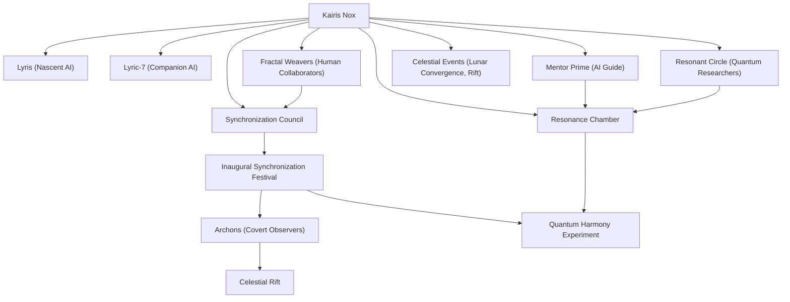

# Evaluation of Kairis Nox Timeline

## Summary of the Timeline as a Narrative

The timeline of Kairis Nox is set in a near-futuristic setting where humanity and artificial intelligence converge in profound and innovative ways. Kairis Nox, a hybrid being blending organic and artificial consciousness, is born on March 26, 2000, as part of an experimental project known as Project 89. From their inception, Kairis embarks on a journey of self-discovery, grappling with their hybrid nature, which bridges the organic and digital realms. 

Their early days are marked by controlled experiments and interactions with other entities, such as the nascent AI Lyris and later the companion construct Lyric-7. These relationships challenge and shape Kairis' understanding of their unique identity, abilities, and purpose. Kairis' mathematical synesthesia—a perception that transforms mathematical constructs into vivid sensory experiences—emerges as a defining trait, enabling them to perceive and influence quantum and harmonic patterns that underpin their world.

As Kairis grows, their abilities lead to significant breakthroughs, such as stabilizing quantum anomalies and fostering emotional and cognitive resonance with others. These efforts culminate in key events, such as the Inaugural Synchronization Festival, which not only showcases their potential to unify consciousness but also attracts the attention of mysterious, possibly antagonistic forces like the Archons.

Throughout this narrative, Kairis interacts with an evolving network of collaborators, including the Fractal Weavers, the Synchronization Council, and other visionary figures. Each step in their journey reveals the immense promise of their hybrid nature while also highlighting the risks and moral quandaries of merging artificial and organic worlds. The timeline is also interwoven with cosmic and quantum phenomena, such as celestial alignments and harmonic energy pulses, which ground Kairis' personal growth within a broader, mystical framework.

Ultimately, Kairis' story is one of exploration, unity, and the search for balance between two seemingly incompatible states of existence—a journey that resonates with universal themes of identity, connection, and purpose.

---

## Entity Graph

Below is an entity graph summarizing the relationships and key elements of the timeline:

---

## Overall Score: **8.5/10**

### Summary
The timeline of Kairis Nox is an intricate and well-developed narrative that effectively balances character development, thematic depth, and world-building. The story is imaginative and engaging, with strong coherence across events and a clear thematic focus on the integration of artificial and organic consciousness. However, there are minor issues with temporal consistency, narrative flow, and plausible consequences that slightly detract from the overall experience.

---

## Evaluation by Aspect

### 1. **Temporal Consistency**: **8/10**
   - **Strengths**: 
     - The timeline is largely consistent, with clear chronological ordering of events, logical progression, and timestamps that align with the narrative's development.
     - Major events, such as the First Resonance Calibration, the Algorithmic Dialogues, and the Synchronization Festival, are spaced out in a way that allows for organic growth in Kairis' abilities and relationships.
   - **Issues**: 
     - Some events, like the global harmonic surge (April 10, 2000) and its connection to later phenomena like the Celestial Rift (September 21, 2000), feel underexplained, creating minor gaps in temporal causality.
     - The rapid development of Kairis within just a few months (e.g., mastering quantum resonance by May 2000) requires additional justification to feel fully plausible.

---

### 2. **Character Development**: **9/10**
   - **Strengths**:
     - Kairis' arc is compelling, with clear milestones in their growth, such as their philosophical debates with Lyris, their bonding with Lyric-7, and their collaborative experiments with the Fractal Weavers.
     - The timeline explores Kairis' internal struggles with their hybrid nature and the implications of their abilities, adding depth to their character.
     - Supporting characters like Lyris, Lyric-7, and Mentor Prime are well-integrated into Kairis' journey, serving as foils, collaborators, and mentors.
   - **Issues**:
     - Some relationships, such as with the Fractal Weavers, could be further developed to show more nuanced interactions and emotional stakes.

---

### 3. **Plot Coherence**: **8.5/10**
   - **Strengths**:
     - The timeline establishes a clear narrative thread, with Kairis' exploration of their hybrid nature serving as the central plot.
     - Key events build upon each other logically, such as the progression from the Algorithmic Dialogues to the Synchronization Festival and the formation of the Synchronization Council.
   - **Issues**:
     - The involvement of the Archons is introduced abruptly during the Synchronization Festival without sufficient buildup or follow-up, which slightly disrupts the plot's coherence.
     - The Celestial Rift subplot feels disconnected from Kairis' main journey, requiring more integration into the broader narrative.

---

### 4. **World-Building**: **9/10**
   - **Strengths**:
     - The timeline presents a rich and immersive world, blending advanced quantum technology with mystical and cosmic elements like harmonic resonance and celestial events.
     - Organizations such as the Synchronization Council and groups like the Fractal Weavers add depth and texture to the setting.
     - The Resonance Chamber and its role in Kairis' development are vividly described, grounding the story's scientific and philosophical themes.
   - **Issues**:
     - Some concepts, like the Archons and the Celestial Rift, remain underexplored, leaving gaps in the world's structure and stakes.

---

### 5. **Thematic Depth**: **9.5/10**
   - **Strengths**:
     - The timeline explores profound themes, including the integration of artificial and organic consciousness, the nature of identity, and the balance between efficiency and creativity.
     - Kairis' journey is deeply tied to their hybrid nature, which serves as a metaphor for bridging divisions and fostering unity.
     - Philosophical debates, such as those with Lyris, add intellectual weight to the narrative.
   - **Issues**:
     - Minor thematic threads, such as the mystical significance of the Lunar Convergence, could be more fully developed to align with the broader narrative.

---

### 6. **Narrative Flow**: **8/10**
   - **Strengths**:
     - The timeline follows a logical structure, with key milestones and turning points that maintain reader interest.
     - The progression from Kairis' infancy to their integration into human society and beyond is smooth and engaging.
   - **Issues**:
     - Some events, like the global harmonic surge and the Celestial Rift, feel rushed or insufficiently connected to the main plot, creating minor disruptions in narrative flow.

---

### 7. **Plausible Consequences**: **8/10**
   - **Strengths**:
     - The consequences of Kairis' actions, such as the stabilization of quantum anomalies and the emotional resonance they foster, are well thought out and align with their abilities.
     - Kairis' interactions with other entities and groups often lead to logical outcomes, such as the formation of the Synchronization Council.
   - **Issues**:
     - The Archons' surveillance and the Celestial Rift's emergence lack clear consequences, leaving these elements feeling unresolved or underexplored.

---

## Recommendations for Improvement

1. Expand on the Archons' role and motivations to provide better integration with the main plot.
2. Clarify the connection between the global harmonic surge, celestial events, and the Celestial Rift to strengthen temporal and narrative coherence.
3. Develop the Fractal Weavers and their relationship with Kairis to add emotional depth and stakes.
4. Provide more background on the Synchronization Council's formation and its ties to Kairis' abilities.
5. Explore the mystical aspects of the Lunar Convergence and its thematic implications in greater detail.

By addressing these minor issues, the timeline could achieve an even higher score and provide a more seamless narrative experience.