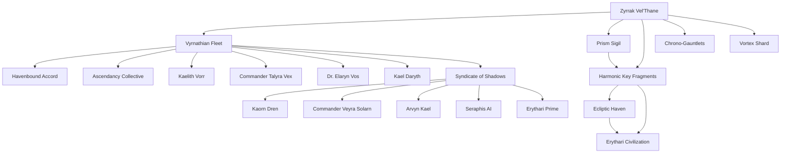

# Timeline Analysis: Evaluation and Scoring

## Narrative Summary

The timeline chronicles the life of Zyrrak Vel'Thane, a pivotal figure in the survival of the Vyrnathian species, as they navigate existential threats after the catastrophic destruction of their homeworld, Vyrnathis Prime. Zyrrak’s journey begins with their birth amid a cosmic anomaly, setting the stage for their symbolic and literal role as a protector of their people. The events follow their leadership through increasingly dire challenges, including galactic exile, relentless pursuit by the Syndicate of Shadows, internal dissent among the fleet, and the unraveling mystery of the harmonic keys and the Prism Sigil.

The story unfolds as a series of escalating crises, from planetary evacuation and space battles to ethical dilemmas and personal sacrifices. Zyrrak’s energy core, the Prism Sigil, and the harmonic keys are central to the narrative, serving as both the fleet's greatest hope and its most dangerous liability. The Syndicate's pursuit of these artifacts adds constant tension, while Zyrrak’s visions hint at a larger cosmic puzzle involving the enigmatic Ecliptic Haven.

The timeline is rich in character development, world-building, and narrative complexity, but it also grapples with themes of leadership, survival, and the moral cost of decisions. The story culminates in a desperate bid to balance the fleet's survival with the growing risks of pursuing the harmonic keys, all while facing internal fractures and external threats.

---

## Entity Graph

---

## Overall Score: **8.2 / 10**

The timeline is well-constructed, with strong narrative flow, consistent internal logic, and compelling character development. However, there are minor issues with temporal consistency and setting coherence, as well as areas for improvement in connecting certain events more naturally. The story is engaging, but the sheer complexity of the timeline sometimes makes it dense and slightly difficult to follow.

---

## 1. Temporal Consistency: **8/10**

### Strengths:
- Events are presented in a clear chronological order, with logical progression and reasonable time gaps between them.
- No major paradoxes or contradictions in the sequence of events.
- The timeline adheres to a well-defined structure, with clear cause-effect relationships.

### Issues:
- The timeline occasionally feels compressed, particularly between **June 1** and **July 20**, where significant events occur in rapid succession without sufficient time for the consequences of earlier events to fully develop (e.g., the fleet’s frequent major expeditions and battles).
- The characters and fleet seem to recover from catastrophic events (e.g., battles or resource depletion) faster than realistically plausible given their dire situation.

---

## 2. Character Development: **9/10**

### Strengths:
- Zyrrak Vel'Thane's growth is well-documented, with clear arcs of leadership, moral dilemmas, and personal sacrifices. Their evolution from a symbolic figure to a practical leader is compelling.
- Supporting characters, such as Commander Talyra Vex, Dr. Elaryn Vos, and Kaelith Vorr, add depth to the narrative and serve as effective foils or allies to Zyrrak.
- The moral struggles and internal dissent among the fleet create believable interpersonal dynamics and highlight the stakes of leadership.

### Issues:
- Some secondary characters (e.g., Kael Daryth, Captain Lyras Teyra) are introduced but not fully fleshed out, making their roles feel underutilized.
- Zyrrak's emotional responses to losses (e.g., Vennik Draal’s death, the Ascendancy Collective’s secession) are occasionally underexplored given the severity of these events.

---

## 3. Setting Coherence: **7.5/10**

### Strengths:
- The timeline features a rich and