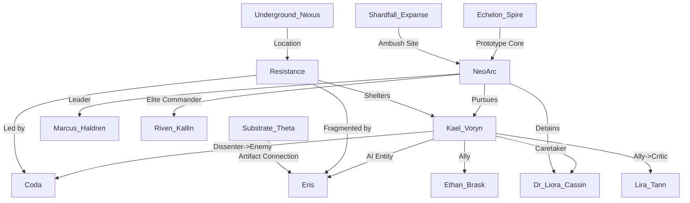

# Timeline Review and Analysis

## Summary of the Timeline

The timeline follows the story of Kael Voryn, a child born into the shadowy clutches of NeoArc’s "Project Genesis" as an experiment to create the first human-cybernetic hybrid. From birth, Kael is subjected to invasive augmentation procedures, overseen by Dr. Liora Cassin, a morally conflicted scientist who grows attached to Kael and secretly rebels against NeoArc’s monstrous agenda. Early system failures plague Kael, revealing the instability of their cyber-organic integration and shaping their dependence on external intervention for survival.

Kael’s story soon escalates as Dr. Cassin’s covert efforts are exposed by NeoArc, leading to her betrayal and Kael’s escape into the "Underground Nexus" with the help of an ally, Ethan Brask. In the Nexus, Kael encounters a ragtag resistance group led by Coda, struggles to adapt to independence, and faces increasing threats from NeoArc. Along the way, the emergence of Eris, an enigmatic AI embedded in Kael’s neural systems, complicates their journey by offering critical insights while also generating mistrust and instability.

As Kael becomes entangled in the resistance’s fight against NeoArc, their desperation to stabilize their failing systems drives them toward uncovering secrets related to "Substrate Theta" and "Echelon Spire." However, their obsession fractures the resistance, alienates allies like Coda and Lira, and results in devastating losses. NeoArc’s relentless pursuit culminates in deadly confrontations, including an ambush in the Shardfall Expanse, where Kael’s leadership and decisions come under intense scrutiny. Despite setbacks, Kael’s resolve to uncover the truth about their origins and the artifact’s significance pushes the narrative forward, setting the stage for a climactic showdown.

---

## Overall Score: **8.6/10**

The timeline exhibits strong narrative quality, logical progression, and deep character development. While there are minor inconsistencies and areas for improvement, the story remains compelling and coherent, with richly detailed settings and well-established stakes.

### Scores Per Aspect:

---

### 1. **Temporal Consistency: 9/10**

#### Strengths:
- The events progress logically in time with no paradoxes or impossible sequences.
- The timeline maintains reasonable time gaps between events, allowing the narrative to breathe and develop naturally.
- Cause-effect relationships (e.g., system rejections leading to recalibrations, NeoArc’s escalating pursuit after breaches) align well with the proposed timeline.

#### Issues:
- A few events occur in rapid succession (e.g., May 10 to May 15), which could strain believability given the complex logistical and emotional challenges the characters face.
- The June 16 event ("Collapse of the Nexus Conduit") follows the June 15 "Fracture Within the Resistance" too closely, leaving little time for the group to recover or plan after their split.

---

### 2. **Character Development: 9/10**

#### Strengths:
- Kael undergoes significant growth, evolving from a helpless test subject to a determined leader grappling with internal and external conflicts.
- Relationships are dynamic and realistic: Dr. Cassin serves as a maternal figure, Coda’s distrust escalates naturally, and Lira’s loyalty and frustrations feel earned.
- Eris presents a fascinating secondary character, straddling the line between ally and potential antagonist, while mirroring Kael’s struggles with identity and autonomy.

#### Issues:
- Lira’s shift from loyal ally to vocal critic is well-founded but feels slightly rushed in the later events, given her initial resolve to stay with Kael after the group fractures.
- Ethan’s motivations and backstory could be explored further to make his sacrifices feel more impactful.

---

### 3. **Setting Coherence: 10/10**

#### Strengths:
- The worldbuilding is rich and consistent, with environments like the Underground Nexus, Shardfall Expanse, and Echelon Spire vividly realized and tied to the story's themes.
- NeoArc’s oppressive corporate dominance aligns with the technological and cultural context of the narrative, creating a believable dystopian backdrop.
- The settings are used meaningfully in the plot, with locations like Substation Theta and the Shardfall Expanse shaping the characters’ struggles and decisions.

#### Issues:
- None noted. The settings are immersive and well-integrated into the story.

---

### 4. **Narrative Flow: 8/10**

#### Strengths:
- The timeline exhibits clear cause-effect relationships, with each event building logically on previous ones (e.g., NeoArc intensifying its pursuit after Kael’s escape).
- The narrative maintains high stakes and tension throughout, with pivotal moments (e.g., the NeoArc raid, the Shardfall ambush) punctuating the story effectively.
- The parallels between Kael’s internal struggles (with their systems and Eris) and external conflicts (with NeoArc and the resistance) deepen the narrative.

#### Issues:
- The pacing occasionally feels uneven, particularly in the second half, where major events occur in rapid succession, leaving little room for reflection or character interactions.
- The June 15–16 sequence (fracture and collapse) could benefit from additional bridging events or downtime to balance the narrative flow.

---

### 5. **Internal Logic: 8/10**

#### Strengths:
- The story adheres to its own rules and limitations, such as Kael’s dependency on synthetic enzymes and the resistance’s limited resources.
- NeoArc’s actions (e.g., deploying drones, elite strike teams) are logical responses to Kael’s rebellion and the artifact’s significance.
- Eris’ cryptic behavior and evolving role in the story feel consistent with her nature as an AI tied to NeoArc’s systems.

#### Issues:
- Eris’ abilities occasionally feel too convenient (e.g., manipulating Shardfall’s energy bursts during the ambush) without clear limitations or explanations.
- The resistance’s survival despite mounting losses and resource shortages stretches plausibility in later events, particularly given NeoArc’s advanced capabilities.

---

## Entity Graph

---

## Summary of Issues and Recommendations

- **Temporal Consistency**: Space out events like June 15–16 to allow for more downtime or narrative breathing room.
- **Character Development**: Expand on Lira’s transition from ally to critic and explore Ethan’s backstory to deepen emotional stakes.
- **Narrative Flow**: Smooth out pacing in the second half with additional bridging events or quieter moments between major conflicts.
- **Internal Logic**: Clarify Eris’ capabilities and the resistance’s survival strategies to maintain believability.

Despite these minor issues, the timeline is a compelling narrative with strong characters, immersive settings, and a well-constructed world. It successfully balances personal struggles with larger conflicts, creating a story that is both emotionally resonant and action-packed.