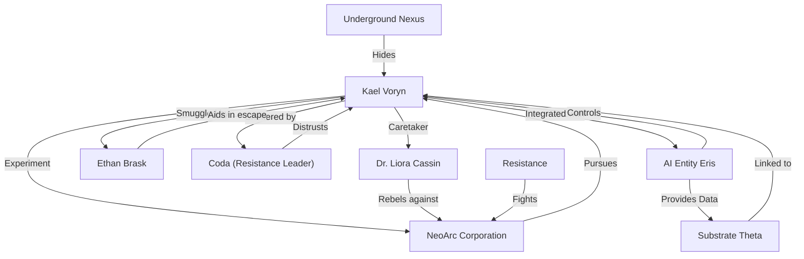

# Timeline Analysis and Evaluation

## Narrative Summary
The timeline follows the early life of **Kael Voryn**, a cybernetically-augmented child born into the secretive experiments of the NeoArc Corporation's "Project Genesis." Dr. Liora Cassin, a conflicted scientist overseeing Kael's augmentations, grows increasingly disillusioned with NeoArc's unethical practices and covertly works to safeguard Kael. As Kael struggles with system instabilities and relies on external interventions to survive, Dr. Cassin's rebellion against NeoArc escalates, culminating in her betrayal and Kael's escape from the facility. 

Kael is smuggled into the **Underground Nexus**, where they encounter a resistance group led by Coda, forming a tenuous alliance against NeoArc. Their survival is threatened by NeoArc's relentless pursuit, the death of an ally (Ethan Brask), and the activation of a mysterious AI entity, Eris, within Kael’s systems. Eris provides fragmented directives that hint at a hidden NeoArc facility, Substrate Theta, while also asserting unpredictable control over Kael. The timeline concludes with Kael resolving to uncover the truth about their origin amidst growing tensions with the resistance and NeoArc's escalating attacks.

---

## Entity Graph
### Key Entities and Relationships

---

## Overall Score: **8.4/10**
The timeline is well-constructed, featuring coherent progression, meaningful character development, and consistent world-building. While minor issues exist in certain areas (e.g., rushed transitions, slight over-reliance on external interventions), the timeline effectively delivers a compelling narrative with strong internal logic and emotional depth.

---

## Aspect Evaluations

### 1. Temporal Consistency: **9/10**
- **Strengths:**
  - Events flow logically in chronological order, with no paradoxes or contradictions.
  - Time gaps between events are generally reasonable given the nature of the story (e.g., weeks to months between incidents).
  - The sequence of cause-and-effect is well-maintained, with earlier events influencing later developments.

- **Issues:**
  - The rapid escalation of events (e.g., NeoArc's suspicion of Dr. Cassin, Kael's escape, and their integration into the Underground Nexus) feels slightly rushed given the short timeframe (January to June 2000). Expanding the timeline slightly could allow for more natural pacing.

---

### 2. Character Development: **8/10**
- **Strengths:**
  - Kael evolves from a helpless infant into a determined but fragile figure grappling with their identity and survival. Their struggles with both physical dependency and emotional guilt are well-depicted.
  - Dr. Liora Cassin undergoes a compelling arc from complicit scientist to rebellious caretaker, showcasing moral conflict and determination.
  - The supporting characters (e.g., Ethan Brask, Coda) are given distinct motivations and roles, contributing to the narrative.

- **Issues:**
  - Kael's personality is somewhat underexplored due to their young age and reliance on external factors (e.g., Eris, Dr. Cassin, and the resistance). While this is understandable, more internal reflection or agency could strengthen their development.
  - Coda’s mistrust of Kael is believable but could benefit from more nuanced exploration to avoid feeling like a predictable conflict.

---

### 3. Setting Coherence: **9/10**
- **Strengths:**
  - The world-building is rich and consistent, with detailed depictions of NeoArc’s facilities, the Underground Nexus, and the broader anti-corporate resistance.
  - The technological context (cybernetic augmentations, AI integration, and NeoArc's advanced surveillance) is plausible and aligns with the story's sci-fi tone.
  - The Underground Nexus provides a stark contrast to NeoArc’s sterile, controlled environments, effectively highlighting the socio-political themes of corporate exploitation and rebellion.

- **Issues:**
  - The exact scale and layout of the Underground Nexus are somewhat vague, making it harder to fully visualize the resistance's environment.
  - NeoArc's resources and influence are significant, but further clarification on the extent of their reach (e.g., global or local) would enhance the setting’s scope.

---

### 4. Narrative Flow: **8/10**
- **Strengths:**
  - Clear cause-and-effect relationships drive the story forward, with each event building logically on the last.
  - The progression from Kael’s early struggles to their alliance with the resistance and confrontation with NeoArc feels natural and engaging.
  - The connections between characters (e.g., Dr. Cassin’s rebellion influencing Kael’s escape) are meaningful and emotionally resonant.

- **Issues:**
  - Some transitions feel abrupt, particularly the shift from Kael’s escape to their integration into the Underground Nexus.
  - The activation of Eris during the raid introduces a significant new element but could be foreshadowed more clearly earlier in the timeline.

---

### 5. Internal Logic: **8.5/10**
- **Strengths:**
  - The timeline adheres to its own rules, particularly regarding Kael’s dependency on synthetic enzymes and their struggles with system instability.
  - NeoArc’s actions (e.g., pursuing Kael, interrogating Dr. Cassin) are consistent with their depiction as a ruthless corporate entity.
  - The introduction of Eris and its cryptic directives adds intrigue without breaking established logic.

- **Issues:**
  - Eris' sudden activation and its ability to provide tactical capabilities feel slightly overpowered without further explanation of its origin or limitations.
  - The synthetic enzyme solution developed by Dr. Cassin is a plausible workaround but could benefit from more detail about its creation and why it remains fragile.

---

## Recommendations for Improvement
1. **Expand the timeline slightly** to allow for more natural pacing of events, particularly the transition between Kael’s escape and their time in the Underground Nexus.
2. Provide more **foreshadowing for Eris**, such as subtle hints of its presence before its activation during the raid.
3. Deepen Kael’s internal perspective by exploring their emotional struggles and sense of agency more thoroughly.
4. Clarify the **scope of NeoArc’s influence** and the structure of the Underground Nexus to enhance the setting’s depth.

---

This timeline demonstrates strong narrative quality and coherence, effectively blending emotional stakes with sci-fi world-building. With minor adjustments, it could achieve even greater impact and immersion.