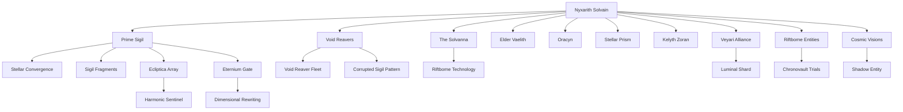

# Timeline Evaluation and Analysis

## Overall Score: **8.4/10**

### Summary of the Timeline as a Narrative
The timeline chronicles the epic journey of **Nyxarith Solvain**, a genetically-engineered and cybernetically-enhanced being born under extraordinary cosmic circumstances. Their birth during a blue supernova imbues them with unique abilities and connections to the multiverse. The story begins with Nyxarith's precarious survival immediately after their birth, followed by their escape from collapsing environments, harrowing encounters with the Void Reavers, and their growing entanglement with ancient Astronexus technology and its cosmic legacy.

Nyxarith's mission is to recover fragments of the **Prime Sigil**, a powerful artifact capable of stabilizing interdimensional harmony but also harboring the potential for catastrophic misuse. Along the way, Nyxarith grapples with internal struggles between their organic and cybernetic components, moral dilemmas, and the mounting burden of their responsibility. The timeline features a mix of high-stakes battles, cryptic warnings, philosophical trials, and alliances with enigmatic entities like the Veyari and Riftborne.

The story culminates in Nyxarith's acquisition of the completed **Prime Sigil**, their discovery of the looming **Eternium Gate**, and the realization that their final choice will determine the fate of countless dimensions. The narrative is infused with themes of balance, sacrifice, and cosmic responsibility, weaving a compelling tale of self-discovery and existential stakes.

---

## Entity Graph

---

# Aspect Scoring and Analysis

## 1. **Temporal Consistency: 9/10**

### Analysis
The timeline is temporally consistent, with events flowing logically in chronological order. Each event builds on the previous one without introducing paradoxes or unreasonable gaps. The timeline spans roughly three months, and the pacing is well-balanced, allowing for both action-driven moments and introspective character development.

### Strengths:
- Clear chronological progression from **Nyxarith's birth** to their journey toward the **Eternium Gate**.
- Logical cause-effect relationships between events (e.g., the energy pulse from the Celestara Awakening alerts the Void Reavers, setting the stage for future confrontations).
- Reasonable time intervals between events ensure believability.

### Issues:
- Minor overlap/redundancy in the descriptions of events occurring on the same day (e.g., details from **Supernova’s Gift**, **Flight to the Sanctuary**, and **Birth of Nyxarith Solvain** could be streamlined into one cohesive event).

---

## 2. **Character Development: 8/10**

### Analysis
Nyxarith’s character undergoes significant development throughout the timeline, evolving from a fragile newborn to a conflicted yet determined leader. The internal conflict between their organic and cybernetic components is a recurring theme that reflects their growth. Secondary characters, like **Elder Vaelith**, **Kelyth Zoran**, and the **Riftborne**, also contribute meaningfully to the narrative.

### Strengths:
- Nyxarith's internal struggles (organic vs. cybernetic) are well-explored and escalate naturally over time.
- Their decisions become more nuanced and morally complex as the stakes rise.
- Relationships with allies like Elder Vaelith, Kelyth Zoran, and the Veyari add depth to the narrative.

### Issues:
- Nyxarith's personality traits and emotional responses could be fleshed out further in some moments (e.g., their reaction to the destruction of the Ecliptica Array feels understated).
- Secondary characters, while engaging, sometimes lack distinct arcs or motivations beyond their support roles.

---

## 3. **Setting Coherence: 8.5/10**

### Analysis
The timeline's settings are imaginative and immersive, with each location contributing to the narrative in meaningful ways. The environments (e.g., the **Obsidian Veil**, **Ecliptica Array**, and **Riftborne Convergence**) are consistent with the story's technological and cosmic themes. However, some settings could be further detailed for clarity.

### Strengths:
- The settings are diverse and visually evocative (e.g., the **Luminara Nexus** and the **Celestara Rift** are vividly described).
- Consistent technological and cultural details reflect the advanced Astronexus civilization and its remnants.
- Environmental hazards (e.g., collapsing structures, gravitational anomalies) are used effectively to build tension.

### Issues:
- Some locations, such as the **Ecliptica Array**, could benefit from more concrete descriptions of their mechanics and significance.
- The Void Reavers' home base or cultural background remains underexplored, even though they are a recurring threat.

---

## 4. **Narrative Flow: 9/10**

### Analysis
The narrative flow is smooth, with clear cause-effect relationships and logical progression between events. The timeline maintains a balance between action, exposition, and introspection. The stakes escalate naturally, culminating in Nyxarith’s confrontation with the completed Prime Sigil.

### Strengths:
- Each event builds on earlier developments, ensuring a cohesive story.
- The transitions between exploration, combat, and introspection are well-paced.
- The gradual revelation of the sigil’s purpose and dangers ties the narrative together.

### Issues:
- Some events, such as the **Shard of Celestara**, feel slightly rushed given their importance to the overall plot.
- A few moments of exposition could be streamlined to maintain momentum.

---

## 5. **Internal Logic: 8.5/10**

### Analysis
The timeline adheres to its established rules and limitations, with Nyxarith's abilities and the sigil's mechanics following a consistent logic. However, some minor ambiguities regarding the sigil’s dual nature and the Void Reavers’ motivations could be clarified.

### Strengths:
- The sigil’s instability and its connection to dimensional anomalies are handled consistently.
- The consequences of Nyxarith’s actions (e.g., activating the sigil fragments) are plausible and impactful.
- The recurrent theme of balance (organic vs. cybernetic, stability vs. destruction) is well-integrated into the story’s logic.

### Issues:
- The exact nature of the **shadow entity** tied to the sigil is left vague, which could detract from the climax if not addressed later.
- The Void Reavers’ ability to track Nyxarith across vast distances could use more explanation (e.g., the mechanics of subspace trackers and dimensional rifts).

---

# Conclusion

### Final Average Score: **8.4/10**

The timeline is a compelling and imaginative narrative with strong character development, immersive settings, and a clear narrative flow. It effectively balances cosmic stakes with personal struggles, exploring themes of responsibility, balance, and sacrifice. While it is generally consistent and coherent, minor areas of redundancy, underexplored secondary characters, and vague lore elements could be refined for greater impact. Overall, it is a well-crafted story with significant potential for deeper exploration.