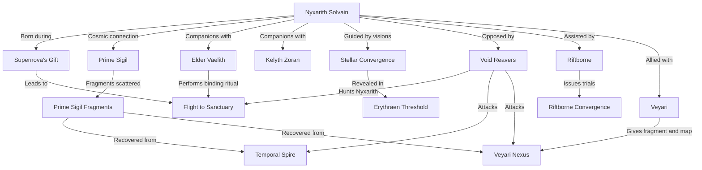

# Timeline Analysis and Evaluation

## Summary of the Timeline

The timeline details the epic journey of **Nyxarith Solvain**, a hybrid being born from the fusion of organic and quantum properties during a rare cosmic event. Infused with immense cosmic potential, Nyxarith must navigate a perilous multiverse to recover the fragments of the **Prime Sigil**, a powerful artifact capable of stabilizing dimensional rifts or causing catastrophic collapse. Alongside their companions—Elder Vaelith, Kelyth Zoran, and others—they face relentless Void Reavers, volatile dimensions, and internal conflicts. The story explores Nyxarith’s evolution as a character, their deepening connection to their cosmic heritage, and the existential weight of their decisions, culminating in a mission that will shape the fate of countless dimensions.

The narrative spans from Nyxarith's birth in 2000-01-16 to the critical events of 2000-03-12, highlighting key moments such as the **Stellar Convergence**, battles with the Void Reavers, and encounters with ancient civilizations like the **Astronexus** and the enigmatic **Riftborne**. It weaves an intricate web of cosmic stakes, moral dilemmas, and escalating urgency as Nyxarith collects the fragments of the sigil and grapples with the duality of its power—salvation or destruction.

---

## Entity Graph

---

## Overall Score: **8.4/10**

The timeline presents an ambitious and well-structured narrative with strong character development, intricate world-building, and a high-stakes progression. However, minor inconsistencies in temporal gaps, occasional redundancies, and slight issues with clarity in cause-effect relationships detract from perfection.

---

## Aspect Evaluations

### 1. **Temporal Consistency: 8/10**
- **Strengths:**
  - Events flow logically in time with no major paradoxes or impossible sequences.
  - The timeline respects chronological order, and the escalation of stakes is consistent across events.
  - The short time frame (January-March 2000) aligns with the urgency of the story.

- **Issues:**
  - Some events feel rushed relative to their significance (e.g., "The Erythraen Threshold" to "The Nexus of Fractured Realities" occurs in just three days, which feels too quick given the enormity of the challenges described).
  - The timeline occasionally lacks explicit time gaps between events, which can make the pacing feel compressed.
  - Minor redundancy in overlapping events (e.g., "Flight to the Sanctuary" and "Birth of Nyxarith Solvain").

---

### 2. **Character Development: 9/10**
- **Strengths:**
  - Nyxarith undergoes significant growth, evolving from an infant with cosmic potential to a morally conflicted leader grappling with the weight of multiversal responsibility.
  - The inner conflict between Nyxarith's organic instincts and cybernetic logic is well-explored, especially during key trials (e.g., Riftborne Convergence, Erythraen Threshold).
  - Supporting characters (Elder Vaelith, Kelyth Zoran, etc.) have distinct roles and contribute meaningfully to the narrative.

- **Issues:**
  - Some secondary characters, like Oracyn and Kelyth, could be developed further beyond their functional roles.
  - Nyxarith’s visions and moral dilemmas are compelling but at times feel repetitive, especially in the later stages.

---

### 3. **Setting Coherence: 9/10**
- **Strengths:**
  - The settings (e.g., Astris-Vael, Luminara Nexus, Erythraen Expanse) are richly detailed and distinct, adding depth to the multiverse.
  - The environments are consistent with the technological and cosmic themes of the story.
  - Use of unique phenomena like dimensional rifts, Stellar Convergence, and gravitational anomalies enhances immersion.

- **Issues:**
  - The extreme variety of settings occasionally risks overwhelming the reader, as transitions between them are sometimes abrupt.
  - The mechanics of certain settings (e.g., the Veyari Nexus collapsing) are underexplained relative to their importance.

---

### 4. **Narrative Flow: 8/10**
- **Strengths:**
  - Strong cause-effect relationships drive the story forward, with each event logically influencing the next.
  - The narrative progression builds tension effectively, culminating in a climactic confrontation with the Void Reavers.
  - Connections between events (e.g., the Prime Sigil fragments influencing the Riftborne and Void Reavers' actions) are meaningful and well-integrated.

- **Issues:**
  - Some sequences feel slightly redundant (e.g., the repeated theme of Nyxarith retrieving sigil fragments while battling Void Reavers).
  - The timeline occasionally prioritizes action over reflection, which can make the emotional weight of decisions feel rushed.
  - The logic behind the Void Reavers' relentless pursuit feels underdeveloped, especially their ability to track Nyxarith despite precautions.

---

### 5. **Internal Logic: 8/10**
- **Strengths:**
  - The rules governing cosmic energy, dimensional rifts, and the Prime Sigil are consistent across the timeline.
  - The consequences of Nyxarith's decisions (e.g., destabilizing facilities to retrieve sigil fragments) are both plausible and impactful.
  - The stakes of the sigil's dual nature (salvation vs. destruction) are clear and well-integrated into the narrative.

- **Issues:**
  - Some technological elements (e.g., the Riftborne technology salvaged to stabilize the Solvanna) strain plausibility due to a lack of detailed explanation.
  - The timeline occasionally introduces elements (e.g., the corrupted shadow entity tied to the sigil) without sufficient setup, which can feel abrupt.
  - The nature and motivations of the Void Reavers remain somewhat vague, which detracts from the clarity of their role as antagonists.

---

## Final Thoughts

This timeline is a richly imagined narrative with compelling characters, high-stakes conflicts, and intricate settings. While it excels in world-building and character development, minor pacing issues and occasional redundancy slightly detract from its overall coherence. With some refinement to event transitions and more detailed exploration of certain elements (e.g., Void Reavers, secondary characters), it has the potential to achieve near-perfection.

**Recommended Improvements:**
- Clarify time gaps between events to improve pacing.
- Expand on secondary characters to give them more depth.
- Provide more detailed explanations of key technologies and antagonist motivations.
- Reduce redundancy in thematic elements (e.g., retrieval of sigil fragments) to maintain narrative freshness.

This timeline is a strong foundation for an epic science-fantasy story with universal stakes and deeply personal conflicts.