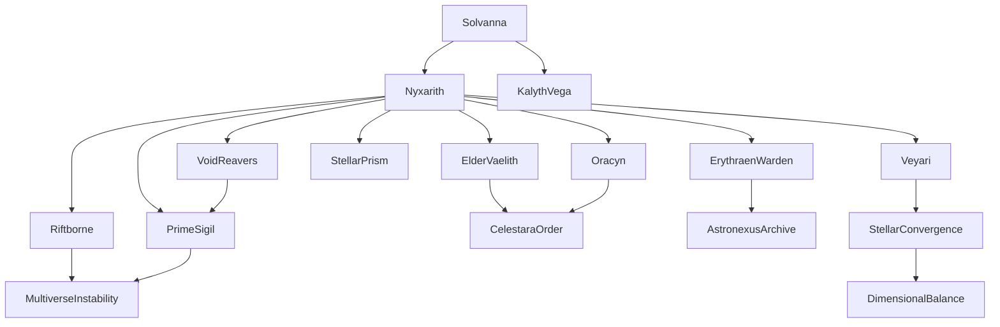

# Timeline Analysis Report

## Narrative Summary

The timeline follows the journey of **Nyxarith Solvain**, a hybrid being of organic and cybernetic origin born amidst a rare cosmic event, the 'Stellar Convergence'. Infused with extraordinary cosmic energy, Nyxarith is thrust into a multiverse-spanning odyssey to uncover their origins, stabilize dimensional realities, and prevent the Void Reavers—a relentless faction— from unleashing chaos across dimensions. 

The narrative begins with Nyxarith's traumatic birth on the collapsing moon of Astris-Vael, leading to their escape alongside Elder Vaelith and the AI Oracyn. Their journey quickly becomes perilous as they flee Void Reaver pursuit, navigate the intricacies of ancient Astronexus technology, and uncover fragments of their people's history. Along the way, Nyxarith struggles to reconcile their fused organic and cybernetic nature while grappling with the immense responsibility of wielding the Prime Sigil—a powerful artifact capable of either stabilizing or destroying the multiverse.

The story's stakes intensify as Nyxarith and their companions traverse treacherous regions of space, confront enigmatic entities like the Riftborne and the Erythraen Warden, and gather fragments of the Prime Sigil. Each event tests Nyxarith's physical and emotional limits, while the looming threat of the Stellar Convergence creates a ticking clock that demands decisive action. The timeline culminates with Nyxarith assembling the Prime Sigil, only to face the existential dilemma of activating it and its potential consequences for the multiverse.

This timeline weaves a rich, high-stakes space opera with themes of identity, sacrifice, and cosmic responsibility.

---

## Overall Score: **8.6/10**

The timeline is a strong, coherent narrative with minor inconsistencies and areas for improvement. It excels in thematic depth, character growth, and its richly detailed world but could benefit from tightening its temporal consistency and ensuring that the stakes and consequences remain grounded in internal logic.

---

## Entity Graph

### Key Entities and Relationships

---

## Aspect Scores and Analysis

### 1. Temporal Consistency: **8/10**
- **Strengths:**
  - Events are presented in a chronological order that flows logically, with no paradoxes or impossible sequences.
  - Reasonable time gaps between events maintain a sense of urgency but allow for character and narrative progression.
  - Cause-effect relationships are mostly clear, with early events (e.g., the shattering of Nyxarith's core sigil and the Celestara Awakening) directly impacting later developments.

- **Issues:**
  - The timeline's pacing occasionally feels rushed, particularly during the transition between major events (e.g., the jump from the Obsidian Veil Gambit to the Starforge Descent). Some events could benefit from additional context or transitional details.
  - The extreme density of events in a short timeframe (January–March 2000) strains believability, particularly given the vast distances and cosmic phenomena involved.
  - The timeline occasionally relies on simultaneous sequences (e.g., fleeing the Void Reavers while discovering pivotal knowledge), which can feel contrived.

---

### 2. Character Development: **9/10**
- **Strengths:**
  - Nyxarith undergoes significant growth throughout the timeline. Their journey from a fragile hybrid to a determined leader grappling with cosmic responsibility is compelling and believable.
  - Key relationships (e.g., Nyxarith and Elder Vaelith, Nyxarith and Oracyn) evolve meaningfully, adding emotional depth.
  - Nyxarith's internal conflict—balancing their organic and cybernetic components—creates a rich, dynamic character arc that reflects the story's themes of identity and sacrifice.

- **Issues:**
  - Secondary characters like Kelyth Zoran and Kalyth Vega are underdeveloped. While they serve functional roles, their personal stakes and growth are less explored.
  - Elder Vaelith's weakening condition is consistently referenced but lacks emotional resonance or resolution.

---

### 3. Setting Coherence: **8.5/10**
- **Strengths:**
  - The timeline presents a richly detailed universe with distinct and imaginative environments, such as the Obsidian Veil, the Veyari Nexus, and the Temporal Spire.
  - The interplay between ancient Astronexus technology, cosmic anomalies, and futuristic elements like the Stellar Prism creates a coherent and immersive setting.
  - The Void Reavers are well-integrated into the setting, with their dimensional incursions adding tension and urgency.

- **Issues:**
  - Some settings (e.g., the Starforge, the Ecliptica Crucible) feel underutilized, with their unique characteristics overshadowed by action sequences.
  - The mechanics of space travel (e.g., how the Solvanna traverses vast distances so quickly) are not fully explained, which occasionally strains plausibility.

---

### 4. Narrative Flow: **8.5/10**
- **Strengths:**
  - Cause-effect relationships are generally strong, with earlier events (e.g., the Stellar Convergence and the shattered core sigil) creating ripple effects that drive later plot points.
  - The stakes escalate naturally, with each event building tension and leading seamlessly into the next.
  - The narrative maintains focus despite its complexity, with the quest for the Prime Sigil providing a clear throughline.

- **Issues:**
  - The sheer number of events and subplots risks overwhelming the reader, particularly when multiple narrative threads (e.g., Void Reaver attacks, sigil recovery, and Nyxarith's self-discovery) intersect in quick succession.
  - Some transitions (e.g., between the Erythraen Threshold and Nexus of Fractured Realities) feel abrupt.

---

### 5. Internal Logic: **9/10**
- **Strengths:**
  - The rules of the universe (e.g., the properties of the Prime Sigil, the role of the Stellar Convergence) are consistent and well-articulated.
  - The consequences of Nyxarith's actions (e.g., the collapse of the Temporal Spire, the activation of the sigil fragment) are logical and impactful.
  - The Void Reavers are a credible and persistent threat, with their motivations and capabilities aligning with the story's internal logic.

- **Issues:**
  - The exact mechanics of the Prime Sigil (e.g., how it balances dimensions, why it was fragmented) are occasionally vague, leaving room for interpretive ambiguity.
  - The timeline occasionally overuses the "critical failure followed by narrow escape" trope, which can strain plausibility.

---

## Recommendations for Improvement
1. **Expand transitional details:** Flesh out the gaps between major events to improve pacing and provide more context for critical decisions.
2. **Develop secondary characters:** Provide more backstory and growth for Kelyth and Kalyth, ensuring they feel as dynamic as Nyxarith.
3. **Clarify the mechanics of key elements:** Elaborate on the functionality of the Prime Sigil, Stellar Prism, and dimensional travel to strengthen internal logic.
4. **Balance action with introspection:** Allow more reflection and emotional beats between action sequences to prevent the narrative from feeling overly frenetic.

---

In conclusion, the timeline is a compelling and imaginative story with minor weaknesses in pacing and secondary character development. Its richly woven narrative, high stakes, and thematic depth make it a strong foundation for further refinement.