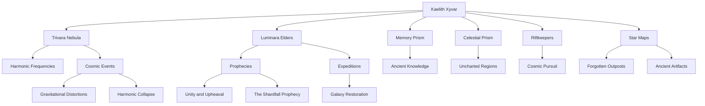

# Evaluation of Kaelith Xyvar Timeline

## Narrative Summary

Kaelith Xyvar's timeline begins with their extraordinary birth within the Trivara Nebula, a cosmic nursery of immense power and significance. Born amidst a rare celestial event called *The Luminous Dawn*, Kaelith's emergence triggers unprecedented cosmic phenomena, including surges of harmonic energy, the activation of ancient Luminara glyphs, and cascading waves of light that ripple across the galaxy. The Nebula itself seems to respond to Kaelith's presence, aligning stars, projecting ancient star maps, and even influencing gravitational fields across nearby systems.

As Kaelith's shifting skin patterns synchronize with the nebula's energy, the Luminara elders recognize them as a harbinger of both unity and upheaval, tied to ancient prophecies that speak of restoring balance to a fractured galaxy. Kaelith's emergence activates dormant mechanisms such as the Celestial Prism, the Luminal Cradle, and the Memory Prism, revealing long-lost knowledge of their species. These mechanisms project star maps and sigils that hint at forgotten Luminara outposts, ancient artifacts, and pathways to distant regions of the galaxy.

Amidst these revelations, Kaelith inadvertently triggers events of cosmic significance, including gravitational anomalies, harmonic waves, and the destabilization of space-time. The Riftkeepers, a shadowy interstellar faction, take notice of these disturbances and begin to pursue Kaelith, believing them to be a destabilizing force. Meanwhile, Kaelith's role as a bridge between dimensions and civilizations becomes increasingly clear, as their connection to the Trivara Nebula deepens and their light patterns reveal ancient truths.

As tensions rise, the elders embark on expeditions to the regions revealed by the star maps, hoping to uncover the remnants of their lost civilization and stabilize the fractures in the galaxy. However, Kaelith's presence continues to strain cosmic forces, leading to events such as *The Shardfall Prophecy* and *The Harmonic Collapse*, which foreshadow both their immense potential and the risks of their existence. The timeline concludes with the galaxy poised on the brink of transformation, with Kaelith at the center of a narrative that intertwines prophecy, ancient knowledge, and cosmic upheaval.

---

## Entity Graph

---

## Overall Score: **7.8/10**

### Summary
The timeline of Kaelith Xyvar is rich in cosmic wonder, intricate world-building, and thematic depth. It effectively weaves together ancient prophecies, advanced technology, and personal stakes. However, inconsistencies in temporal flow, occasional redundancies, and an unclear narrative focus detract from its coherence. While the timeline does well to establish Kaelith's significance, it could benefit from streamlining the sequence of events and clarifying the relationship between certain cosmic phenomena and their consequences.

---

## Evaluation by Aspect

### 1. **Temporal Consistency: 7/10**
   - The events are mostly well-ordered, but there are some issues with pacing and overlap. For example:
     - Multiple events (*The Nebular Convergence's First Light*, *The Luminal Path's Revelation*, *The Celestial Glyph's Resonance*) feel temporally redundant, all involving star maps and glyph activations shortly after Kaelith's birth.
     - The timeline occasionally jumps ahead without sufficient narrative grounding, such as the introduction of the Riftkeepers without clear buildup.
   - Recommendations:
     - Consolidate redundant events or clarify how they build upon one another.
     - Smooth transitions between major milestones, such as the shift from Kaelith's birth to the expeditions.

### 2. **Character Development: 8/10**
   - Kaelith's role as a harbinger of cosmic change is well-established, but their personal development remains largely passive. They are often described as reacting to cosmic events rather than actively shaping them.
   - The Luminara elders serve as strong secondary characters, but individual elders like Zivaran and Eryndor could be more distinct.
   - Recommendations:
     - Show Kaelith taking more agency, even as an infant, to strengthen their character arc.
     - Flesh out the motivations and conflicts among the Luminara elders to add depth.

### 3. **Plot Coherence: 7/10**
   - The timeline maintains a clear central theme (Kaelith's connection to the nebula and their role in cosmic restoration), but the sheer number of interconnected events can feel overwhelming.
   - Some events, like *The Rift's Murmur* and *The Harmonic Collapse*, feel underexplored and disconnected from the main plot.
   - Recommendations:
     - Trim or merge less impactful events to streamline the narrative.
     - Provide clearer cause-and-effect relationships for major phenomena.

### 4. **World-Building: 9/10**
   - The Trivara Nebula, the Luminara species, and their artifacts (e.g., Memory Prisms, Celestial Prism) are richly detailed and immersive.
   - The inclusion of external factions like the Riftkeepers adds intrigue, though their motivations could be more developed.
   - Recommendations:
     - Expand on the Riftkeepers' perspective to enhance their role as antagonists.
     - Clarify the function and origin of key artifacts, such as the Luminal Key.

### 5. **Thematic Depth: 9/10**
   - Themes of unity, cosmic balance, and the burden of prophecy are compellingly woven throughout the timeline.
   - The duality of Kaelith as both a savior and a potential harbinger of destruction adds complexity to their story.
   - Recommendations:
     - Explore more interpersonal themes, such as Kaelith's relationship with their parent, Eryndris.
     - Deepen the existential stakes of the prophecies, showing how they affect different factions.

### 6. **Narrative Flow: 7/10**
   - While individual events are engaging, the overall flow feels uneven. Some sections, such as *The Shardfall Prophecy* and *The Nebular Pulse*, interrupt the momentum without advancing the core narrative.
   - The timeline's climax is unclear, as the story continues to build without a definitive turning point.
   - Recommendations:
     - Emphasize a central narrative arc with clear stages: Kaelith's birth, their awakening, the Riftkeepers' pursuit, and the expeditions.
     - Define a climactic event that sets the stakes for the next phase of Kaelith's journey.

### 7. **Plausible Consequences: 8/10**
   - The timeline does a good job showing how Kaelith's birth impacts the galaxy, from gravitational anomalies to the activation of ancient mechanisms.
   - However, some consequences feel underexplored, such as the societal divisions among the Luminara and the Riftkeepers' interpretation of Kaelith as a threat.
   - Recommendations:
     - Show more tangible effects of the cosmic disturbances on civilizations beyond the Luminara.
     - Develop the Riftkeepers' response to Kaelith's actions to heighten tension.

---

### Final Recommendations

- **Streamline the timeline** by consolidating redundant or less impactful events.
- **Develop Kaelith's agency** and their relationships with key characters like Eryndris and the elders.
- **Clarify the narrative arc**, ensuring each event builds toward a central climax.
- **Deepen faction dynamics**, particularly the Riftkeepers and their interpretation of Kaelith's role.

By addressing these areas, the timeline can better balance its cosmic scope with a coherent and emotionally resonant story.