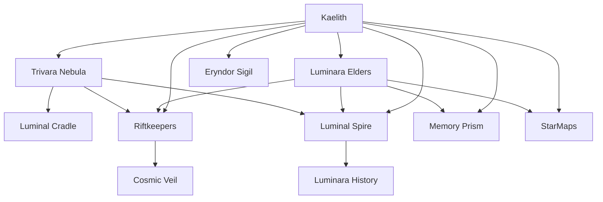

# Evaluation: Timeline of Kaelith Xyvar

---

## Summary: The Timeline as a Narrative

The timeline of **Kaelith Xyvar** is a sprawling, intricate tale of cosmic significance, beginning with their birth under the radiant glow of the Trivara Nebula. As a being of unprecedented luminosity and shifting light patterns, Kaelith's emergence triggers a cascade of celestial and metaphysical phenomena. The Luminara, an ancient species deeply connected to the nebula, interpret these events as the fulfillment of long-lost prophecies foretelling a harbinger destined to unify fractured dimensions and restore balance to the galaxy.

From the moment of their birth, Kaelith's presence creates ripples across the fabric of space-time, manifesting as harmonic waves, gravitational anomalies, and the activation of dormant mechanisms and ancient glyphs. These events reveal forgotten pathways, star maps, and mysterious insights into the Luminara's history, painting Kaelith as both a bridge to their species' fractured legacy and a potential catalyst for galactic upheaval.

The Luminara elders, led by figures such as High Elder Zivaran and Elder Eryndor, work to interpret the nebula's responses while safeguarding Kaelith from external threats. However, the Riftkeepers—a shadowy faction monitoring cosmic disturbances—interpret Kaelith's birth as a threat to space-time stability and begin a pursuit to intercept them.

As the timeline progresses, Kaelith's role expands from a passive catalyst to an active participant in uncovering the mysteries of the galaxy. Through telepathic bursts, synchronized glyphs, and visions of ancient artifacts like the Luminal Spire and the Eryndor Sigil, Kaelith begins to unlock paths to a fractured galaxy. Meanwhile, their influence destabilizes cosmic balances, resulting in events like the Shardfall Prophecy and the Harmonic Collapse, foreshadowing the immense burden they carry as a being of cosmic significance.

This timeline blends themes of destiny, unity, and cosmic mystery, interweaving Kaelith's journey with the galaxy's fate. However, the narrative also leaves room for doubt, fear, and conflict among the Luminara and external factions, creating an atmosphere of both hope and foreboding as Kaelith's role continues to unfold.

---

## Entity Graph: Key Entities and Their Relationships

---

## Overall Score: **8.0/10**

**Summary:** The timeline of Kaelith Xyvar is deeply ambitious, with rich world-building and thematic depth. While it achieves an epic scale and cosmic intrigue, issues with temporal consistency, narrative coherence, and plausible consequences prevent it from achieving full marks. The story occasionally feels overwhelming due to the density of events, and some threads lack clear resolutions or connections, impacting the flow and clarity.

---

## Aspect Evaluations

### 1. Temporal Consistency: **7/10**
- **Strengths:**
  - The timeline adheres to a clear chronological structure, with events progressively building upon Kaelith's birth.
  - Most events logically follow from one another, particularly the cosmic phenomena triggered by Kaelith's emergence.
  
- **Issues:**
  - Certain events feel temporally redundant (e.g., multiple instances of glyph activation and star map projection) without clear differentiation.
  - The escalation of consequences sometimes feels abrupt, such as the sudden appearance of the Riftkeepers without sufficient buildup.
  - The Shardfall Prophecy's placement after significant cosmic events feels slightly out of sync, as it implies Kaelith's importance was still in doubt despite earlier confirmations.

---

### 2. Character Development: **7.5/10**
- **Strengths:**
  - Kaelith is portrayed as a compelling and enigmatic figure, with their shifting light patterns symbolizing their evolving role.
  - The supporting characters, particularly the Luminara elders, provide a sense of cultural and spiritual depth, adding weight to their interpretations of Kaelith's significance.
  
- **Issues:**
  - Kaelith's inner thoughts, personality, and agency are underexplored; they mostly serve as a passive catalyst rather than an active character.
  - The Riftkeepers lack individual characterization, reducing their impact as potential antagonists.
  - The emotional stakes for Kaelith's parent, Eryndris, are mentioned but not developed further.

---

### 3. Plot Coherence: **7.5/10**
- **Strengths:**
  - The central arc of Kaelith's emergence, their connection to the nebula, and the activation of ancient mechanisms is coherent and engaging.
  - The buildup of external conflict with the Riftkeepers and cosmic instability adds tension to the narrative.
  
- **Issues:**
  - Some events feel repetitive, such as multiple projections of star maps and glyph activations, which blur the progression of Kaelith's journey.
  - The stakes and goals for the Luminara elders are sometimes unclear, particularly regarding the expedition to the beacon.
  - The Riftkeepers' motivations and actions are underexplained, leaving gaps in the narrative.

---

### 4. World-Building: **9/10**
- **Strengths:**
  - The Trivara Nebula, Luminal Cradle, and Luminara civilization are richly detailed and evocative, creating a vibrant cosmic setting.
  - The integration of artifacts like the Memory Prism and the Luminal Spire adds depth and mystery to the world.
  - The cosmic phenomena, such as harmonic frequencies and cascading light waves, are imaginative and reinforce the narrative's themes.
  
- **Issues:**
  - The exact nature of the Riftkeepers and their connection to the cosmic veil remains vague.
  - The galactic consequences of Kaelith's emergence are hinted at but not fully explored.

---

### 5. Thematic Depth: **9.5/10**
- **Strengths:**
  - The timeline explores themes of unity, destiny, and cosmic balance with sophistication, tying Kaelith's journey to the galaxy's fractured state.
  - The duality of hope and fear surrounding Kaelith's role adds emotional and philosophical weight to the story.
  - The recurring motif of light as a bridge between dimensions and knowledge is beautifully executed.
  
- **Issues:**
  - The theme of agency vs. destiny is underdeveloped, as Kaelith's thoughts and choices are rarely explored.

---

### 6. Narrative Flow: **7/10**
- **Strengths:**
  - The timeline maintains an epic, cosmic tone that draws the reader into the mystery of Kaelith's role.
  - Major milestones, such as Kaelith's birth and the activation of the Luminal Spire, provide clear narrative anchors.
  
- **Issues:**
  - The density of events, particularly in the early timeline, creates a sense of narrative overload and diminishes the impact of key moments.
  - Some transitions between events feel abrupt, such as the sudden involvement of the Riftkeepers.

---

### 7. Plausible Consequences: **8.5/10**
- **Strengths:**
  - The cosmic consequences of Kaelith's birth, such as gravitational distortions and harmonic collapses, feel appropriately grand and impactful.
  - The reactions of the Luminara elders and external civilizations are logical, given the scale of the events.
  
- **Issues:**
  - The Riftkeepers' rapid escalation of interest in Kaelith feels rushed and lacks sufficient narrative groundwork.
  - The Shardfall Prophecy, while thematically resonant, feels disconnected from the larger narrative.

---

## Final Thoughts

The timeline of Kaelith Xyvar is an ambitious, richly imagined narrative that succeeds in delivering cosmic intrigue and thematic depth. However, it struggles with pacing, coherence, and character development, which occasionally detract from its otherwise immersive world-building and narrative flow. Refining these areas could elevate the story into a masterpiece of speculative fiction.