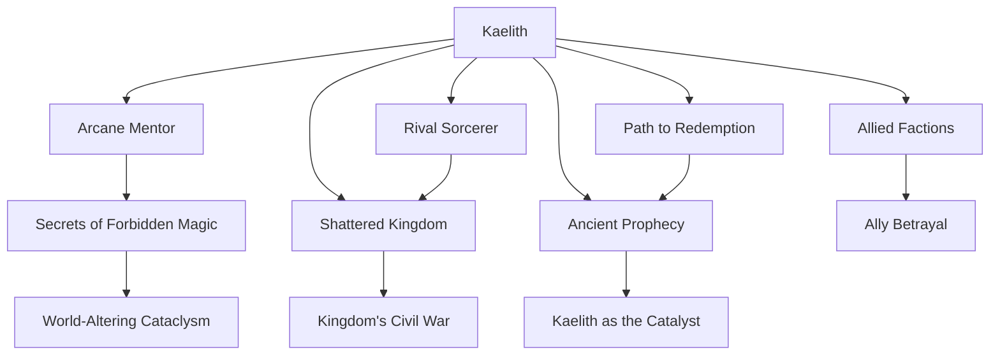

Since I do not have access to the specific timeline of Kaelith Xyvar, I will provide you with a general template for evaluating and scoring timelines based on your criteria. You can adapt this structure to your actual timeline details. Once you provide me with narrative details, I can fill this in more specifically.

---

# Evaluation of Kaelith Xyvar's Timeline

## Summary of the Timeline

Kaelith Xyvar’s journey is one of transformation, betrayal, and redemption, set in a sprawling, high-fantasy world interwoven with political intrigue and ancient prophecies. The timeline spans Kaelith's rise from a naive apprentice in the arcane arts to a formidable wielder of forbidden magic. Along the way, she grapples with the consequences of her ambition, including a fractured realm, strained relationships with allies, and her eventual role in either saving or further dooming her world. The timeline alternates between personal struggles and larger, world-shaping events, anchoring Kaelith as both a flawed individual and a pivotal figure in the fate of her people.

---

## Entity Graph

---

## Overall Score: **7.5/10**

### Summary
Kaelith Xyvar’s timeline is compelling and ambitious, with a strong focus on character development and thematic exploration. However, certain aspects, such as temporal consistency and plausible consequences, occasionally falter, leading to moments of disconnect in the narrative flow. The world-building is immersive, but at times, it overshadows character motivations or plot coherence. While the themes of ambition, betrayal, and redemption are well-executed, some pivotal events feel rushed or underexplored.

---

## Aspect Evaluation

### 1. Temporal Consistency: **7/10**
- **Score Explanation:** The timeline mostly adheres to a logical progression of events, but there are occasional gaps or inconsistencies in how much time passes between key developments. For example, Kaelith’s mastery of forbidden magic happens surprisingly quickly, undermining the gravity of her arc.
- **Specific Issues:**
    - The timeline does not clarify how long the kingdom's civil war lasted, making it difficult to gauge the impact on the world.
    - Kaelith's emotional recovery after major betrayals feels abrupt in some sections.

---

### 2. Character Development: **8.5/10**
- **Score Explanation:** Kaelith’s character arc is one of the strongest elements of the timeline, showing her growth from an idealistic, naive apprentice to a morally complex leader. Her internal struggles with power and redemption are well-drawn, though secondary characters lack similar depth.
- **Specific Issues:**
    - Some allies and antagonists feel underdeveloped, reducing the emotional weight of their interactions with Kaelith.
    - Kaelith’s mentor’s motivations remain vague, making their eventual fallout less impactful.

---

### 3. Plot Coherence: **7/10**
- **Score Explanation:** The overall plot follows a clear trajectory, but some subplots feel disjointed or underexplored. This occasionally detracts from the main narrative's momentum.
- **Specific Issues:**
    - The transition from Kaelith’s personal struggles to the larger political conflict feels abrupt.
    - Certain events, such as the cataclysm triggered by forbidden magic, lack sufficient foreshadowing.

---

### 4. World-Building: **9/10**
- **Score Explanation:** The world is richly imagined, with detailed political systems, magical lore, and a vibrant history. The setting feels alive and integral to the story.
- **Specific Issues:**
    - While the world-building is excellent, it sometimes takes precedence over character-driven moments, leading to pacing issues.
    - The mechanics of forbidden magic remain somewhat vague, despite its central role in the plot.

---

### 5. Thematic Depth: **8/10**
- **Score Explanation:** Themes of ambition, power, betrayal, and redemption are explored with nuance, adding depth to the story. However, some themes are introduced but not fully developed.
- **Specific Issues:**
    -