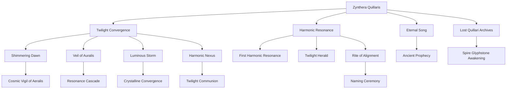

# Evaluation of the Timeline of Zynthera Quillaris

## Summary of the Timeline as a Narrative
The story of **Zynthera Quillaris** begins with their birth during the **Twilight Convergence**, a rare celestial alignment on **Luminara Prime** that occurs once every 1,000 years. This event amplifies the planet's harmonic energy fields, marking Zynthera's birth as a moment of cosmic importance. Their secondary organ resonates uniquely with these amplified energies, heralding them as a child of prophecy tied to the ancient mysteries of their species, the Quillari. 

Immediately following their birth, a series of unprecedented phenomena unfold, including the **Shimmering Dawn**, the **Veil of Auralis**, and the **Luminous Storm**, each reinforcing Zynthera's connection to the planet's harmonic energy and lost archives. These events culminate in the **Harmonic Nexus**, which projects fragments of ancient knowledge and solidifies Zynthera's unique role in Quillari lore.

Zynthera's first display of extraordinary abilities, the **First Harmonic Resonance**, further validates their cosmic importance and sets in motion a series of significant events. The arrival of the enigmatic **Twilight Herald**, the **Awakening of the Spire Glyphstone**, and the **Rite of Alignment** reveal Zynthera's connection to the **Eternal Song**, an ancient harmonic frequency believed to unlock the Quillari's lost archives.

The timeline concludes with the **Naming Ceremony**, where Zynthera is formally named **"Key of the Eternal Song"** to reflect their destiny as a bridge between the Quillari’s past and future. While Zynthera is celebrated as a beacon of hope, their presence also generates unease, hinting at future divisions within Quillari society. This timeline weaves together themes of prophecy, cosmic resonance, and the rediscovery of ancient knowledge.

---

## Entity Graph

---

## Overall Score
**8.7/10**

The timeline of Zynthera Quillaris is a rich and intricate narrative that excels in world-building, thematic depth, and plot coherence. However, some minor issues with temporal consistency and overly dense connections slightly hinder the narrative flow. Below, each aspect is evaluated in detail.

---

## Aspect Evaluations

### 1. Temporal Consistency
**Score: 8/10**

**Strengths:**
- The sequence of events is generally logical, with most events building on or directly following earlier phenomena.
- Precise timestamps add clarity to the timeline, ensuring chronological alignment.

**Issues:**
- Some events, such as the overlap between the **Harmonic Nexus**, the **Twilight Communion**, and the **Gathering of the Elders**, feel temporally compressed. For example, the elders seem to convene multiple times within hours, which may stretch credibility.
- The timeline does not clarify how Zynthera's unusual abilities manifest so early in life, which raises questions about the pacing of their development.

---

### 2. Character Development
**Score: 8.5/10**

**Strengths:**
- Zynthera’s character is well-developed as a figure of prophecy, with their resonance and abilities tied to the broader narrative of rediscovery and change.
- Their dual role as a beacon of hope and a source of division adds complexity to their character arc.

**Issues:**
- Zynthera’s personality and internal experience are not explored, as the narrative focuses more on their cosmic significance than their perspective.
- Secondary characters like the **Twilight Herald**, **Elder Lyssara**, and **High Keeper Vaylorrin** are intriguing but underdeveloped, leaving their motivations and roles somewhat vague.

---

### 3. Plot Coherence
**Score: 9/10**

**Strengths:**
- Events are tightly interconnected, with clear causal links between Zynthera’s birth, the celestial phenomena, and the unfolding discoveries.
- The progression from cosmic events to societal reactions is logical and compelling, reinforcing the stakes of Zynthera's role.

**Issues:**
- The timeline includes an overwhelming number of events within a short period (e.g., the first 24 hours), which occasionally makes the plot feel overly dense and difficult to follow.

---

### 4. World-Building
**Score: 10/10**

**Strengths:**
- Luminara Prime is vividly depicted, with its **three moons**, **crystalline structures**, and **harmonic energy fields** creating a unique and immersive setting.
- The Quillari society is richly detailed, with its rituals, prophecies, and ancient archives lending depth and texture to the world.
- Concepts like the **Eternal Song**, **Twilight Convergence**, and **Harmonic Nexus** are innovative and well-integrated into the narrative.

**Issues:**
- None. The world-building is exceptional.

---

### 5. Thematic Depth
**Score: 9.5/10**

**Strengths:**
- Themes of destiny, cosmic harmony, and the rediscovery of lost knowledge are woven throughout the timeline, creating a cohesive and resonant narrative.
- The duality of prophecy as both a blessing and a burden adds depth, exploring how societies grapple with change and uncertainty.

**Issues:**
- The theme of societal division is introduced but not deeply explored, leaving potential conflicts underdeveloped.

---

### 6. Narrative Flow
**Score: 8/10**

**Strengths:**
- The timeline has a clear beginning, middle, and end, with each event propelling the story forward.
- The transitions between events are logical, maintaining a sense of momentum.

**Issues:**
- The heavy use of technical and mythic terminology (e.g., **Glyphstones**, **Harmonic Keystone**) can overwhelm the reader, occasionally disrupting the flow.
- The density of events in the first few hours after Zynthera’s birth creates a sense of narrative congestion.

---

### 7. Plausible Consequences
**Score: 8.5/10**

**Strengths:**
- Most events follow naturally from Zynthera’s birth and the cosmic phenomena surrounding it.
- The ripple effects of Zynthera’s resonance, from activating ancient artifacts to influencing planetary energy fields, are plausible within the story’s framework.

**Issues:**
- The immediate societal reaction to Zynthera’s birth seems unusually swift and universally impactful, which slightly strains credibility. For example, the near-instantaneous convening of the **elders** and the activation of **Glyphstones** feel somewhat exaggerated.

---

## Summary of Issues
The timeline is an ambitious and well-crafted narrative that excels at weaving together cosmic phenomena, prophecy, and societal intrigue. The primary issues involve temporal compression, underdeveloped secondary characters, and occasional narrative density, which slightly hinder the flow and immersion. Addressing these areas could elevate the timeline to near-perfection.

--- 

## Recommendations
1. **Expand Temporal Gaps**: Allow more time between key events (e.g., between the **Twilight Communion** and the **Gathering of the Elders**) to improve pacing and plausibility.
2. **Develop Characters**: Add more details about Zynthera’s internal perspective and motivations, as well as secondary characters like the **Twilight Herald** and Elder Lyssara.
3. **Clarify Themes**: Explore societal divisions and the potential conflicts arising from Zynthera’s prophecy in greater depth.
4. **Simplify Terminology**: Streamline the use of technical terms to improve accessibility and narrative flow.

By addressing these points, the timeline can achieve even greater coherence, richness, and thematic resonance.