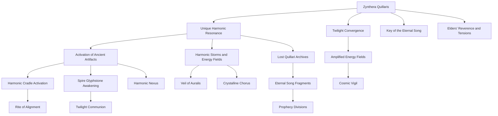

# Timeline Evaluation: Zynthera Quillaris

## Summary of the Timeline

The timeline of Zynthera Quillaris revolves around their birth on the planet Luminara Prime during a rare celestial event called the Twilight Convergence, a once-in-a-millennium alignment of the planet's three moons. This event amplifies the planet’s harmonic energy fields, marking Zynthera as a being of immense cosmic significance tied to the ancient lore of the Quillari species. Their unique resonance, emitted from a secondary organ at birth, catalyzes a series of extraordinary phenomena, including the activation of dormant artifacts, harmonic storms, and projections of lost ancient knowledge.

The elders of the Quillari society, deeply entrenched in their traditions and mythology, interpret these events as signs of prophecy. Zynthera is named the “Key of the Eternal Song,” a figure believed to be central to rediscovering the lost archives of the Quillari and unlocking their forgotten knowledge. Despite their reverence, Zynthera's presence begins to sow unease and division within the society, as some fear the potential disruptions tied to their arrival.

The timeline features a series of escalating events, including the manifestation of harmonic phenomena like the Crystalline Chorus, the Harmonic Nexus, and the Veil of Auralis. These events highlight Zynthera’s connection to ancient artifacts, prophecies, and cosmic forces. The elders perform sacred rituals such as the Rite of Alignment and the Twilight Communion to deepen their understanding of Zynthera’s role in their species' destiny. However, the timeline also introduces tensions and skepticism within their society, setting the stage for future conflicts and challenges.

The narrative weaves themes of cosmic destiny, societal upheaval, and the rediscovery of ancient knowledge, with Zynthera positioned as both a beacon of hope and a harbinger of change.

---

## Entity Graph

---

## Overall Score: **8.3/10**

The timeline is well-constructed, offering a rich narrative with strong world-building and thematic depth. However, it has minor inconsistencies and pacing challenges. Below is a detailed breakdown of the evaluation.

---

## 1. **Temporal Consistency**: **8/10**
The timeline is mostly coherent in terms of chronology, with events logically following one another. However, there are minor issues:

- **Strengths**:
  - Events are clearly timestamped, allowing for an easy understanding of the progression from Zynthera’s birth to subsequent phenomena.
  - The sequence of celestial and harmonic events builds naturally, with each event influencing or enabling the next.

- **Issues**:
  - There are overlapping interpretations of key events (e.g., the Twilight Communion and the Naming Ceremony both claim to reveal the "Key of the Eternal Song").
  - Some events, like the Shimmering Dawn and the Crystalline Chorus, occur in rapid succession, which might compress the timeline unrealistically.

---

## 2. **Character Development**: **7/10**
Zynthera is at the center of the timeline, but as an infant, their agency is limited. Their development is more implied than shown.

- **Strengths**:
  - Zynthera’s resonance and cosmic significance are explored through the reactions of the elders and society.
  - Their symbolic role as the "Key of the Eternal Song" is well-established, setting them up as a pivotal figure in future narratives.

- **Issues**:
  - Zynthera’s personal growth is absent due to their infancy, which limits character depth.
  - The focus on Zynthera as a prophetic symbol overshadows their individuality, making them feel more like a plot device than a fully realized character.

---

## 3. **Plot Coherence**: **9/10**
The timeline presents a clear and escalating series of events centered on Zynthera's birth and significance.

- **Strengths**:
  - The progression from cosmic phenomena to societal reactions and rituals is logical and compelling.
  - Key events, such as the Harmonic Cradle Activation, the Rite of Alignment, and the Twilight Communion, are interlinked and reinforce the central narrative of Zynthera’s importance.

- **Issues**:
  - The timeline occasionally leans heavily on exposition, with some events feeling redundant (e.g., multiple rituals and gatherings that interpret similar phenomena).

---

## 4. **World-Building**: **9/10**
The timeline excels in creating a vivid and immersive world, with detailed descriptions of Quillari society, artifacts, and rituals.

- **Strengths**:
  - The harmonic energy fields, Glyphstones, and Eternal Song add depth to the Quillari’s culture and mythology.
  - The integration of celestial events, artifacts, and harmonic phenomena creates a cohesive and unique setting.
  - The societal divisions and fear of prophecy add realism to the Quillari’s response to Zynthera’s arrival.

- **Issues**:
  - Some terms, such as “Harmonic Nexus” and “Eternal Song,” are repeated frequently without deeper exploration, risking thematic redundancy.

---

## 5. **Thematic Depth**: **9/10**
The timeline explores profound themes of destiny, knowledge, and societal change.

- **Strengths**:
  - The interplay between cosmic forces and individual significance is well-developed.
  - The theme of rediscovering lost knowledge is compelling and ties into the Quillari’s cultural identity.
  - The tension between hope and fear regarding prophecy adds complexity to the narrative.

- **Issues**:
  - The elders’ skepticism and societal divisions could be explored more deeply to add nuance to the themes of prophecy and disruption.

---

## 6. **Narrative Flow**: **8/10**
The timeline follows a logical progression, but the pacing could be improved in places.

- **Strengths**:
  - The escalation of events from Zynthera’s birth to the societal and cosmic implications is well-structured.
  - The transitions between celestial phenomena, harmonic activations, and societal rituals are smooth.

- **Issues**:
  - The rapid succession of events immediately after Zynthera’s birth may feel overwhelming, with little time to reflect on the significance of each phenomenon.
  - The timeline occasionally feels cluttered with overlapping events and interpretations.

---

## 7. **Plausible Consequences**: **8/10**
The consequences of Zynthera’s birth and resonance are generally well-thought-out but could use more exploration.

- **Strengths**:
  - The activation of ancient artifacts and the elders’ decisions to perform rituals feel like natural reactions to Zynthera’s birth.
  - The societal divisions and fear of prophecy are plausible outcomes of Zynthera’s significance.

- **Issues**:
  - The long-term consequences of events like the Harmonic Nexus and the Cosmic Vigil are hinted at but not fully developed.
  - The immediate harmony between Zynthera and ancient artifacts could feel overly convenient without more explanation.

---

## Recommendations for Improvement

1. **Expand Zynthera’s Character**:
   - Introduce moments showcasing Zynthera’s individuality, even as an infant, to balance their symbolic role with personal development.

2. **Refine World-Building**:
   - Provide more detail on the societal divisions and the fears surrounding Zynthera’s role.
   - Explore the implications of the harmonic phenomena on daily life in Quillari society.

3. **Adjust Pacing**:
   - Slow down the timeline to allow for reflection between major events, particularly immediately after Zynthera’s birth.

4. **Deepen Themes**:
   - Examine the elders’ skepticism and societal tensions in greater detail to add complexity to the narrative.

By addressing these points, the timeline can achieve greater narrative depth, coherence, and emotional resonance.